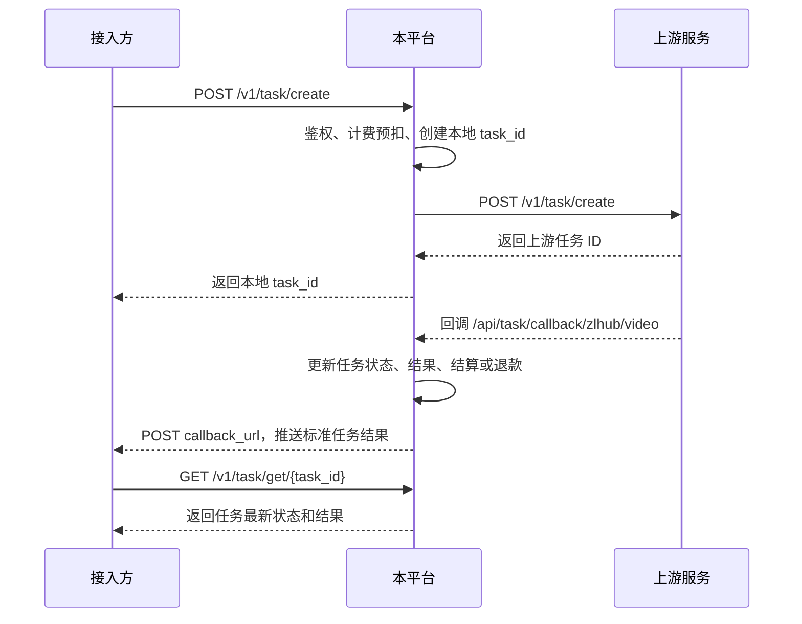

# 视频生成与素材审核对外接入文档

本文档面向接入方，说明如何通过本平台调用 ZLHub 视频生成与素材审核能力。接入方只需要关注本平台暴露的接口、任务 ID、查询和回调格式，不需要直接对接上游服务。

## 1. 接入信息

### 1.1 Base URL

```text
https://your-domain.com
```

请将示例中的 `https://your-domain.com` 替换为实际服务地址。

### 1.2 鉴权方式

所有对外业务接口均使用 Bearer Token 鉴权：

```http
Authorization: Bearer <API_KEY>
Content-Type: application/json
X-Trace-ID: <TRACE_ID>
```

`X-Trace-ID` 为可选但推荐传入的请求追踪 ID。创建视频任务时，接入方传入后平台会透传给上游；未传时平台会自动生成。查询和取消以本地 `task_id` 为主要追踪依据；素材审核上游使用平台生成的 `X-Track-Id`。

### 1.3 接口总览

| 场景 | 方法 | 路径 | 说明 |
|---|---|---|---|
| 创建视频任务 | POST | `/v1/task/create` | 创建异步视频生成任务 |
| 查询视频任务 | GET | `/v1/task/get/{task_id}` | 查询任务状态和结果 |
| 取消视频任务 | POST | `/v1/task/cancel/{task_id}` | 取消未完成任务 |
| 同步素材审核 | POST | `/v1/asset/upload/sync` | 提交素材并同步等待结果 |
| 异步素材审核 | POST | `/v1/asset/upload/async` | 提交素材审核任务 |
| 查询素材审核 | GET | `/v1/asset/task/{task_id}` | 查询异步素材审核结果 |

## 2. 视频生成流程



说明：

- 创建接口返回的是本平台本地任务 ID，格式一般为 `task_xxx`。
- 查询、取消、回调中都应使用或保存本地 `task_id`。
- 接入方不需要保存上游任务 ID；响应中的 `upstream_id` 仅用于排查问题，不建议作为业务主键。
- 即使配置了 `callback_url`，仍建议保留查询逻辑作为兜底。

## 3. 创建视频任务

```http
POST /v1/task/create
```

### 3.1 请求体

| 字段 | 类型 | 必填 | 说明 |
|---|---|---|---|
| `model` | string | 是 | 模型名称，支持 `doubao-seedance-2.0`、`doubao-seedance-2.0-fast` |
| `content` | object[] | 是 | 输入给模型的信息，支持文本、图片、视频、音频、样片任务 ID |
| `callback_url` | string | 否 | 接收任务状态变化通知的公网 HTTP(S) 地址 |
| `return_last_frame` | bool | 否 | 是否在查询结果中返回尾帧图像 |
| `service_tier` | string | 否 | 服务等级，默认 `default` |
| `execution_expires_after` | int | 否 | 任务超时时间，单位秒，默认 `172800` |
| `generate_audio` | bool | 否 | 是否生成音频，默认 `true` |
| `draft` | bool | 否 | 是否开启样片模式，取决于模型是否支持 |
| `tools` | object[] | 否 | 工具配置，例如联网搜索 |
| `safety_identifier` | string | 否 | 终端用户唯一标识，建议传哈希值 |
| `ratio` | string | 否 | 视频比例，例如 `16:9`、`9:16`、`21:9`、`adaptive` |
| `resolution` | string | 否 | 输出分辨率，例如 `480p`、`720p`、`1080p` |
| `duration` | int | 否 | 输出视频时长，单位秒 |
| `frames` | int | 否 | 输出视频帧数；与 `duration` 二选一，优先级高于 `duration` |
| `watermark` | bool | 否 | 是否添加水印 |
| `seed` | int | 否 | 随机种子 |
| `camera_fixed` | bool | 否 | 是否固定摄像头，取决于模型是否支持 |

`content` 支持以下对象：

| 类型 | 示例 | 说明 |
|---|---|---|
| 文本 | `{"type":"text","text":"提示词"}` | 文生视频或配合素材描述生成目标视频 |
| 图片 | `{"type":"image_url","image_url":{"url":"https://example.com/a.jpg"},"role":"first_frame"}` | `role` 可为 `first_frame`、`last_frame`、`reference_image` |
| 视频 | `{"type":"video_url","video_url":{"url":"https://example.com/a.mp4"},"role":"reference_video"}` | 仅 Seedance 2.0 系列支持参考视频 |
| 音频 | `{"type":"audio_url","audio_url":{"url":"https://example.com/a.mp3"},"role":"reference_audio"}` | 仅 Seedance 2.0 系列支持参考音频，不能单独输入音频 |
| 样片任务 | `{"type":"draft_task","draft_task":{"id":"cgt-xxx"}}` | 仅支持对应模型的样片转正式视频能力 |

注意：

- 对外只提供 `content` 数组这一种请求方式。
- 图片、视频、音频 URL 可以使用公网 HTTP(S) 地址；审核素材可使用 `Asset://<ASSET_ID>`。
- `duration` 和 `frames` 二选一即可；同时传入时 `frames` 优先。
- `doubao-seedance-2.0-fast` 不支持 `1080p`。
- 不同模型对 `draft`、`camera_fixed`、`frames` 等参数支持不同；不支持的参数可能被上游拒绝或忽略。

### 3.2 文生视频示例

```bash
curl -X POST "https://your-domain.com/v1/task/create" \
  -H "Authorization: Bearer <API_KEY>" \
  -H "Content-Type: application/json" \
  -d '{
    "model": "doubao-seedance-2.0",
    "content": [
      {"type": "text", "text": "一个女孩在海边奔跑，电影感镜头，自然光"}
    ],
    "duration": 6,
    "ratio": "16:9",
    "resolution": "720p",
    "generate_audio": true,
    "watermark": false,
    "callback_url": "https://client.example.com/callback/video"
  }'
```

### 3.3 图生视频首帧示例

```bash
curl -X POST "https://your-domain.com/v1/task/create" \
  -H "Authorization: Bearer <API_KEY>" \
  -H "Content-Type: application/json" \
  -d '{
    "model": "doubao-seedance-2.0",
    "content": [
      {"type": "text", "text": "让图片中的人物自然转身并微笑"},
      {
        "type": "image_url",
        "image_url": {"url": "https://client.example.com/assets/person.jpg"},
        "role": "first_frame"
      }
    ],
    "duration": 5,
    "ratio": "9:16",
    "resolution": "720p"
  }'
```

### 3.4 图生视频首尾帧示例

```bash
curl -X POST "https://your-domain.com/v1/task/create" \
  -H "Authorization: Bearer <API_KEY>" \
  -H "Content-Type: application/json" \
  -d '{
    "model": "doubao-seedance-2.0",
    "content": [
      {"type": "text", "text": "根据首帧和尾帧生成流畅过渡的视频"},
      {
        "type": "image_url",
        "image_url": {"url": "https://client.example.com/assets/first.jpg"},
        "role": "first_frame"
      },
      {
        "type": "image_url",
        "image_url": {"url": "https://client.example.com/assets/last.jpg"},
        "role": "last_frame"
      }
    ],
    "duration": 8,
    "ratio": "16:9",
    "resolution": "720p"
  }'
```

### 3.5 多模态参考示例

```bash
curl -X POST "https://your-domain.com/v1/task/create" \
  -H "Authorization: Bearer <API_KEY>" \
  -H "Content-Type: application/json" \
  -d '{
    "model": "doubao-seedance-2.0",
    "content": [
      {"type": "text", "text": "参考图片中的人物、视频动作和音频节奏生成一段自拍视频"},
      {
        "type": "image_url",
        "image_url": {"url": "https://client.example.com/assets/ref.jpg"},
        "role": "reference_image"
      },
      {
        "type": "video_url",
        "video_url": {"url": "https://client.example.com/assets/motion.mp4"},
        "role": "reference_video"
      },
      {
        "type": "audio_url",
        "audio_url": {"url": "https://client.example.com/assets/voice.mp3"},
        "role": "reference_audio"
      }
    ],
    "duration": 6,
    "ratio": "16:9",
    "resolution": "720p",
    "generate_audio": true,
    "callback_url": "https://client.example.com/callback/video"
  }'
```

### 3.6 使用审核素材示例

```bash
curl -X POST "https://your-domain.com/v1/task/create" \
  -H "Authorization: Bearer <API_KEY>" \
  -H "Content-Type: application/json" \
  -d '{
    "model": "doubao-seedance-2.0",
    "content": [
      {"type": "text", "text": "参考审核通过的图片生成视频"},
      {
        "type": "image_url",
        "image_url": {"url": "Asset://Asset-20260520120000-xxxxx"},
        "role": "reference_image"
      }
    ],
    "duration": 6,
    "ratio": "16:9",
    "resolution": "720p"
  }'
```

### 3.7 创建响应

创建成功后返回本地任务 ID：

```json
{
  "code": "success",
  "message": "",
  "data": {
    "id": "task_fywJTIsAR1DYIyEVRWkG35n3Xesyx1RE",
    "task_id": "task_fywJTIsAR1DYIyEVRWkG35n3Xesyx1RE",
    "model": "doubao-seedance-2.0",
    "status": "queued",
    "created_at": 1779273982
  }
}
```

字段说明：

| 字段 | 说明 |
|---|---|
| `data.id` | 本平台任务 ID |
| `data.task_id` | 同 `data.id`，查询、取消和回调幂等使用该字段 |
| `data.status` | 初始状态，一般为 `queued` |
| `data.created_at` | 创建时间，Unix 秒时间戳 |

## 4. 查询视频任务

```http
GET /v1/task/get/{task_id}
```

### 4.1 请求示例

```bash
curl -X GET "https://your-domain.com/v1/task/get/task_fywJTIsAR1DYIyEVRWkG35n3Xesyx1RE" \
  -H "Authorization: Bearer <API_KEY>"
```

### 4.2 查询响应

```json
{
  "code": "success",
  "message": "",
  "data": {
    "id": "task_fywJTIsAR1DYIyEVRWkG35n3Xesyx1RE",
    "task_id": "task_fywJTIsAR1DYIyEVRWkG35n3Xesyx1RE",
    "upstream_id": "cgt-20260520184622-8kk4d",
    "model": "doubao-seedance-2.0",
    "status": "succeeded",
    "error": null,
    "content": {
      "video_url": "https://example.com/video.mp4",
      "last_frame_url": "https://example.com/last-frame.png"
    },
    "usage": {
      "completion_tokens": 131137,
      "total_tokens": 131137,
      "tool_usage": {
        "web_search": 1
      }
    },
    "created_at": 1779273982,
    "updated_at": 1779274249,
    "seed": 89117,
    "resolution": "720p",
    "ratio": "21:9",
    "duration": 6,
    "framespersecond": 24,
    "tools": [
      {"type": "web_search"}
    ],
    "safety_identifier": "user-hash",
    "service_tier": "default",
    "execution_expires_after": 172800,
    "generate_audio": true,
    "draft": false,
    "draft_task_id": "cgt-draft"
  }
}
```

### 4.3 任务状态

| 状态 | 说明 |
|---|---|
| `queued` | 排队中 |
| `running` | 生成中 |
| `succeeded` | 生成成功 |
| `failed` | 生成失败 |
| `cancelled` | 任务已取消 |
| `expired` | 任务超时 |

说明：

- 成功后从 `data.content.video_url` 获取视频地址。
- 如果创建任务时设置 `return_last_frame: true`，且上游返回尾帧，则可从 `data.content.last_frame_url` 获取尾帧图像。
- `data.duration` 和 `data.frames` 只会返回一个；创建时指定 `frames` 时优先返回 `frames`。
- `data.usage` 为本次任务实际 token 用量，最终计费以平台计费配置和实际用量为准。
- `data.error`、`data.tools`、`data.safety_identifier`、`data.draft_task_id` 等字段按上游查询结果保留。
- 响应不会返回上游完整原始响应，也不会出现 `data.data` 嵌套结构。

## 5. 取消视频任务

```http
POST /v1/task/cancel/{task_id}
```

仅支持取消未完成的 ZLHub 视频任务。

### 5.1 请求示例

```bash
curl -X POST "https://your-domain.com/v1/task/cancel/task_fywJTIsAR1DYIyEVRWkG35n3Xesyx1RE" \
  -H "Authorization: Bearer <API_KEY>"
```

### 5.2 响应示例

```json
{
  "code": "success",
  "message": "",
  "data": {
    "id": "task_fywJTIsAR1DYIyEVRWkG35n3Xesyx1RE",
    "status": "cancelled"
  }
}
```

## 6. 视频任务回调

创建任务时传入 `callback_url` 后，任务状态变化时平台会向该地址发送 POST 请求。

### 6.1 回调要求

| 项目 | 说明 |
|---|---|
| 请求方法 | POST |
| Content-Type | `application/json` |
| 超时时间 | 5 秒 |
| 重试次数 | 最多 3 次 |
| 成功条件 | 接入方返回 HTTP 2xx |

### 6.2 回调请求体

回调请求体与 `GET /v1/task/get/{task_id}` 的响应结构一致：

```json
{
  "code": "success",
  "message": "",
  "data": {
    "id": "task_fywJTIsAR1DYIyEVRWkG35n3Xesyx1RE",
    "task_id": "task_fywJTIsAR1DYIyEVRWkG35n3Xesyx1RE",
    "model": "doubao-seedance-2.0",
    "status": "succeeded",
    "error": null,
    "content": {
      "video_url": "https://example.com/video.mp4"
    },
    "usage": {
      "completion_tokens": 131137,
      "total_tokens": 131137,
      "tool_usage": {
        "web_search": 1
      }
    },
    "duration": 6,
    "resolution": "720p",
    "ratio": "21:9",
    "framespersecond": 24,
    "tools": [
      {"type": "web_search"}
    ],
    "safety_identifier": "user-hash",
    "generate_audio": true,
    "draft": false,
    "draft_task_id": "cgt-draft"
  }
}
```

### 6.3 回调处理建议

- 使用 `data.task_id` 做幂等键。
- 同一个任务可能收到多个状态回调，业务侧应允许重复通知。
- 最终状态为 `succeeded` 或 `failed`。
- 如果未收到回调，应使用查询接口兜底。

## 7. 素材审核

素材审核用于提前审核图片、视频或音频素材。审核通过后返回的 `Asset://` 地址可以用于视频生成请求中的素材 URL。

### 7.1 同步提交审核

```http
POST /v1/asset/upload/sync
```

同步接口会等待审核结果返回，适合少量素材。

```bash
curl -X POST "https://your-domain.com/v1/asset/upload/sync" \
  -H "Authorization: Bearer <API_KEY>" \
  -H "Content-Type: application/json" \
  -d '{
    "images": [
      "https://client.example.com/assets/photo1.jpg"
    ],
    "asset_type": "Image"
  }'
```

### 7.2 异步提交审核

```http
POST /v1/asset/upload/async
```

异步接口会立即返回素材审核任务 ID，后续通过查询接口获取结果。

```bash
curl -X POST "https://your-domain.com/v1/asset/upload/async" \
  -H "Authorization: Bearer <API_KEY>" \
  -H "Content-Type: application/json" \
  -d '{
    "images": [
      "https://client.example.com/assets/photo1.jpg",
      "https://client.example.com/assets/photo2.jpg"
    ],
    "asset_type": "Image"
  }'
```

### 7.3 查询素材审核

```http
GET /v1/asset/task/{task_id}
```

```bash
curl -X GET "https://your-domain.com/v1/asset/task/asset-task-id" \
  -H "Authorization: Bearer <API_KEY>"
```

### 7.4 素材审核请求字段

| 字段 | 类型 | 必填 | 说明 |
|---|---|---|---|
| `images` | string[] | 是 | 素材 URL 列表，最多 50 条 |
| `asset_type` | string | 否 | `Image`、`Video`、`Audio`，默认 `Image` |

注意：

- 素材 URL 必须是公网可访问的 HTTP(S) 地址。
- 不支持 base64。
- 同一批次素材类型必须一致。
- 当前素材审核接口不支持接入方自定义 `callback_url`，异步结果请通过查询接口获取。

### 7.5 审核结果关键字段

| 字段 | 说明 |
|---|---|
| `submit_review_status` | `1` 表示通过，`0` 表示失败 |
| `asset_url` | `Asset://` 地址，可用于视频生成 |
| `downstream_final_url` | 临时访问地址 |
| `error_code` / `error_message` | 审核失败原因 |

## 8. 使用审核素材生成视频

审核通过后，将 `asset_url` 放入视频生成请求中：

```bash
curl -X POST "https://your-domain.com/v1/task/create" \
  -H "Authorization: Bearer <API_KEY>" \
  -H "Content-Type: application/json" \
  -d '{
    "model": "doubao-seedance-2.0",
    "content": [
      {"type": "text", "text": "参考审核通过的图片生成视频"},
      {
        "type": "image_url",
        "image_url": {"url": "Asset://Asset-20260520120000-xxxxx"},
        "role": "reference_image"
      }
    ],
    "duration": 6,
    "ratio": "16:9"
  }'
```

## 9. 计费说明

- 视频生成任务创建时会按官方视频 token 公式预扣额度：`输出宽 * 输出高 * 帧数 / 1024`，其中帧数优先使用 `frames`，否则使用 `duration * 24`。
- 如果输入包含参考视频，平台会额外按 4 秒输入视频做预扣估算；任务完成后仍以实际返回用量结算。
- 任务成功后按模型计费配置和上游返回的 `usage.completion_tokens` 结算。
- 任务失败、取消或超时会按平台规则退还预扣额度。
- 素材审核接口当前不走视频任务计费流程。

## 10. 常见错误

| HTTP 状态 | code / message | 说明 |
|---|---|---|
| 400 | `invalid_request` | 请求参数错误 |
| 401 | Unauthorized | Token 无效或缺失 |
| 404 | `task_not_exist` | 任务不存在或不属于当前账号 |
| 429 | Too Many Requests | 请求频率超过限制 |
| 502 | `cancel_task_failed` | 上游取消任务失败 |
| 500 | `get_task_failed` / `update_task_failed` | 平台内部处理失败 |

## 11. 最小接入示例

```python
import time
import requests

BASE_URL = "https://your-domain.com"
API_KEY = "<API_KEY>"
HEADERS = {
    "Authorization": f"Bearer {API_KEY}",
    "Content-Type": "application/json",
}

create_resp = requests.post(
    f"{BASE_URL}/v1/task/create",
    headers=HEADERS,
    json={
        "model": "doubao-seedance-2.0",
        "content": [
            {"type": "text", "text": "一个女孩在海边奔跑，电影感镜头"},
        ],
        "duration": 6,
        "ratio": "16:9",
    },
)
create_resp.raise_for_status()
task_id = create_resp.json()["data"]["task_id"]

while True:
    query_resp = requests.get(f"{BASE_URL}/v1/task/get/{task_id}", headers=HEADERS)
    query_resp.raise_for_status()
    data = query_resp.json()["data"]
    print(data["status"])

    if data["status"] == "succeeded":
        print(data["content"]["video_url"])
        break
    if data["status"] == "failed":
        raise RuntimeError("video task failed")

    time.sleep(10)
```
