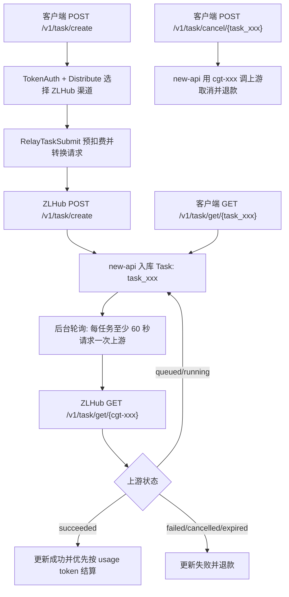
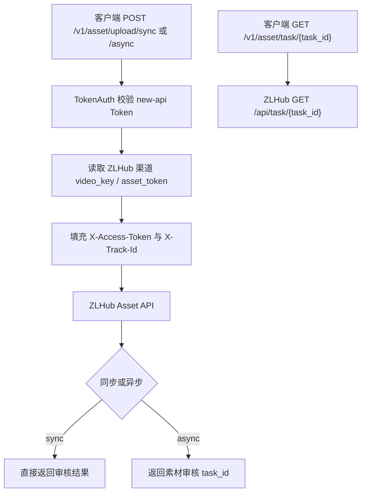

# ZLHub 渠道集成指南

本指南说明如何通过 new-api 使用 ZLHub 的视频生成与素材审核服务。详细字段说明请参阅 [ZLHub API 接口文档](../../zlhub-api-docs.md)。

## 渠道配置

| 项目 | 值 |
|------|------|
| 渠道类型 | ZLHub（编号 58） |
| 默认 Base URL | `https://api.zlhub.cn` |
| 支持模型 | `doubao-seedance-2.0`, `doubao-seedance-2.0-fast` |

### 密钥格式

ZLHub 使用两套独立凭证，用 `|` 分隔：

| 场景 | 密钥格式 | 示例 |
|------|----------|------|
| 仅视频生成 | `video_api_key` | `sk-abc123` |
| 视频 + 素材审核 | `video_api_key\|asset_access_token` | `sk-abc123\|tk-xyz789` |
| 两 Key 相同 | `key` | `sk-abc123`（自动复用） |

> 视频生成 API 使用 `Authorization: Bearer <key>`，素材审核 API 使用 `X-Access-Token: <token>`。new-api 会根据接口自动选用。

## 推荐接口总览

| 场景 | 推荐接口 | 兼容/高级接口 | ID 说明 |
|------|----------|---------------|---------|
| 创建视频任务 | `POST /v1/task/create` | `POST /v1/videos` | 返回 new-api 本地任务 ID：`task_xxx` |
| 查询视频任务 | `GET /v1/task/get/{task_id}` | `GET /v1/videos/{task_id}` | 使用本地 `task_xxx` |
| 取消视频任务 | `POST /v1/task/cancel/{task_id}` | `POST /api/zlhub/v1/task/cancel/{upstream_task_id}` | 推荐接口使用本地 `task_xxx`；原生透传使用上游 `cgt-xxx` |
| 同步素材审核 | `POST /v1/asset/upload/sync` | `POST /api/zlhub/asset/upload` 且 body 中 `async=false` | 素材审核任务 ID 来自 ZLHub |
| 异步素材审核 | `POST /v1/asset/upload/async` | `POST /api/zlhub/asset/upload` 且 body 中 `async=true` | 素材审核任务 ID 来自 ZLHub |
| 查询素材审核 | `GET /v1/asset/task/{task_id}` | `GET /api/zlhub/asset/task/{task_id}` | 使用素材审核任务 ID |

> 正常业务侧只需要保存和使用 new-api 返回的 `task_xxx`。ZLHub 上游任务 ID（如 `cgt-20260421174743-w9q85`）由系统保存在 `Task.PrivateData.UpstreamTaskID`，仅原生透传接口需要直接使用。

## 视频生成 API

视频生成走 **标准 relay 任务流程**（与 doubao 等渠道一致），自动处理计费、任务追踪、取消和轮询。推荐使用 `/v1/task/create`、`/v1/task/get/{task_id}`、`/v1/task/cancel/{task_id}` 这一组任务风格接口；`/v1/videos` 仍保留为 OpenAI Video 兼容入口。

### 请求流程

```
客户端 POST /v1/task/create（或兼容入口 /v1/videos）
        │
        ▼
  controller.RelayTask()
        │
        ▼
  relay.RelayTaskSubmit()
        │
        ├─ ValidateRequestAndSetAction → 自动识别格式，提取计费字段
        ├─ EstimateBilling → duration → OtherRatios{"seconds": 5}
        ├─ PreConsumeBilling → 预扣用户额度
        ├─ BuildRequestBody → 原生格式原样转发 / 标准格式转换为原生格式
        ├─ DoRequest → 发送到 ZLHub 上游
        ├─ DoResponse → 解析返回，提取 upstreamTaskID
        └─ AdjustBillingOnSubmit → 提交后计费调整
        │
        ▼
  成功后:
        ├─ SettleBilling → 结算计费
        ├─ LogTaskConsumption → 记录日志
        └─ task.Insert() → 插入 Task 记录（本地 task_xxx，PrivateData 保存上游 task_id 与 BillingContext）
```

后台轮询 `TaskPollingLoop` 定期调用 `FetchTask` 查询上游状态 → `ParseTaskResult` 解析结果 → `AdjustBillingOnComplete` 最终结算。全局轮询循环每 15 秒扫描未完成任务，ZLHub 单个任务对上游的实际查询间隔至少 60 秒。



### 格式一：标准 TaskSubmitReq（推荐）

```
POST /v1/task/create
```

请求体遵循 new-api 标准 `TaskSubmitReq` 格式，由 relay 系统自动转换为 ZLHub 原生格式。

**请求字段：**

| 字段 | 类型 | 必填 | 说明 |
|------|------|------|------|
| model | string | 是 | 模型名：`doubao-seedance-2.0` 或 `doubao-seedance-2.0-fast` |
| prompt | string | 是 | 文本提示词 |
| images | string[] | 否 | 参考图片 URL 列表 |
| duration | int | 否 | 视频时长（秒），默认 5 |
| size | string | 否 | 视频比例，如 `16:9`。当格式符合宽高比时会映射到 ZLHub `ratio` |
| metadata | object | 否 | 扩展字段（见下方） |

**metadata 扩展字段：**

| 字段 | 类型 | 说明 |
|------|------|------|
| generate_audio | bool | 是否生成音频 |
| watermark | bool | 是否添加水印 |
| ratio | string | 视频比例 |
| resolution | string | 输出分辨率，如 `480p` / `720p` / `1080p` |
| seed | int | 随机种子 |
| content | array | ZLHub 原生 content 数组（图片角色等高级用法） |
| image_roles | array | 图片角色映射，如 `[{"index": 0, "role": "first_frame"}]`。`index` 会按图片下标生效 |

**示例 — 基础文生视频：**

```bash
curl -X POST http://your-server/v1/task/create \
  -H "Authorization: Bearer <your-new-api-token>" \
  -H "Content-Type: application/json" \
  -d '{
    "model": "doubao-seedance-2.0",
    "prompt": "一个女孩在海边奔跑",
    "duration": 5
  }'
```

**示例 — 图生视频（参考图）：**

```bash
curl -X POST http://your-server/v1/task/create \
  -H "Authorization: Bearer <your-new-api-token>" \
  -H "Content-Type: application/json" \
  -d '{
    "model": "doubao-seedance-2.0",
    "prompt": "让图中的人物跳舞",
    "images": ["https://example.com/photo.jpg"],
    "duration": 5
  }'
```

**示例 — 首尾帧生成（指定图片角色）：**

```bash
curl -X POST http://your-server/v1/task/create \
  -H "Authorization: Bearer <your-new-api-token>" \
  -H "Content-Type: application/json" \
  -d '{
    "model": "doubao-seedance-2.0",
    "prompt": "根据首帧和尾帧图片，生成流畅过渡的高清视频",
    "images": ["https://example.com/first.jpg", "https://example.com/last.jpg"],
    "duration": 8,
    "metadata": {
      "image_roles": [
        {"index": 0, "role": "first_frame"},
        {"index": 1, "role": "last_frame"}
      ]
    }
  }'
```

### 格式二：ZLHub 原生格式（高级）

同样通过 `POST /v1/task/create` 发送，但请求体使用 ZLHub 上游的原生格式。adaptor 会自动识别 `content` 字段并原样转发到上游，同时自动提取计费所需字段（`model`、`duration`）和追踪字段（`prompt`）。

**原生格式与上游完全一致**，额外自动注入 `callback_url` 字段并处理模型映射。

**示例 — 原生格式文生视频：**

```bash
curl -X POST http://your-server/v1/task/create \
  -H "Authorization: Bearer <your-new-api-token>" \
  -H "Content-Type: application/json" \
  -d '{
    "model": "doubao-seedance-2.0",
    "content": [
        {"type": "text", "text": "一个女孩在海边奔跑"}
    ],
    "generate_audio": true,
    "ratio": "16:9",
    "duration": 5,
    "watermark": false
  }'
```

**示例 — 原生格式多模态参考：**

```bash
curl -X POST http://your-server/v1/task/create \
  -H "Authorization: Bearer <your-new-api-token>" \
  -H "Content-Type: application/json" \
  -d '{
    "model": "doubao-seedance-2.0",
    "content": [
        {"type": "text", "text": "全程使用视频1的第一视角构图"},
        {"type": "image_url", "image_url": {"url": "https://example.com/img1.jpg"}, "role": "reference_image"},
        {"type": "video_url", "video_url": {"url": "https://example.com/vid1.mp4"}, "role": "reference_video"},
        {"type": "audio_url", "audio_url": {"url": "https://example.com/audio1.mp3"}, "role": "reference_audio"}
    ],
    "generate_audio": true,
    "ratio": "16:9",
    "duration": 11,
    "watermark": false
  }'
```

**示例 — 原生格式首尾帧：**

```bash
curl -X POST http://your-server/v1/task/create \
  -H "Authorization: Bearer <your-new-api-token>" \
  -H "Content-Type: application/json" \
  -d '{
    "model": "doubao-seedance-2.0",
    "content": [
        {"type": "text", "text": "根据首帧和尾帧图片，生成流畅过渡的高清视频"},
        {"type": "image_url", "image_url": {"url": "https://example.com/first.jpg"}, "role": "first_frame"},
        {"type": "image_url", "image_url": {"url": "https://example.com/last.jpg"}, "role": "last_frame"}
    ],
    "generate_audio": true,
    "ratio": "16:9",
    "duration": 8,
    "watermark": false
  }'
```

**示例 — 使用审核通过的素材（`Asset://`）：**

```bash
curl -X POST http://your-server/v1/task/create \
  -H "Authorization: Bearer <your-new-api-token>" \
  -H "Content-Type: application/json" \
  -d '{
    "model": "doubao-seedance-2.0",
    "content": [
        {"type": "text", "text": "参考图片1中的人物"},
        {"type": "image_url", "image_url": {"url": "Asset://Asset-20260411120001-xxxxx"}, "role": "reference_image"}
    ]
  }'
```

### 响应格式

创建成功返回标准 OpenAI Video 格式。这里的 `id` / `task_id` 是 new-api 本地任务 ID，不是 ZLHub 上游任务 ID。

```json
{
  "id": "task_abc123",
  "task_id": "task_abc123",
  "model": "doubao-seedance-2.0",
  "created_at": 1747660800,
  "status": "queued"
}
```

### 查询视频任务

```
GET /v1/task/get/{task_id}
```

通过标准 relay 查询接口获取任务状态，由轮询系统自动从 ZLHub 上游同步。`task_id` 使用创建接口返回的本地 `task_xxx`。兼容入口 `GET /v1/videos/{task_id}` 仍可使用。

### 取消视频任务

```
POST /v1/task/cancel/{task_id}
```

推荐使用本地任务取消接口。new-api 会读取本地任务中的上游 ID，调用 ZLHub `/v1/task/cancel/{cgt-xxx}`，然后将本地任务标记为失败并退还已预扣额度。

**示例：**

```bash
curl -X POST http://your-server/v1/task/cancel/task_abc123 \
  -H "Authorization: Bearer <your-new-api-token>"
```

```json
{
  "code": "success",
  "message": "",
  "data": {
    "id": "task_abc123",
    "status": "cancelled"
  }
}
```

### 原生透传接口（高级）

如需直接调用 ZLHub 原生 API（不经计费系统），可使用以下透传接口：

| 操作 | 方法 | URL |
|------|------|-----|
| 查询视频任务 | GET | `/api/zlhub/v1/task/get/{task_id}` |
| 取消视频任务 | POST | `/api/zlhub/v1/task/cancel/{task_id}` |

> **注意**：透传接口直接转发请求到 ZLHub 上游，`task_id` 为 ZLHub 上游任务 ID（`cgt-xxx`），不经过本地任务状态更新和退款逻辑。业务侧取消任务推荐使用 `POST /v1/task/cancel/{task_xxx}`。

**取消任务示例：**

```bash
curl -X POST http://your-server/api/zlhub/v1/task/cancel/cgt-20260421174743-w9q85 \
  -H "Authorization: Bearer <your-new-api-token>"
```

```json
{
  "code": "success",
  "message": "",
  "data": {
    "id": "cgt-20260421174743-w9q85",
    "status": "cancelled"
  }
}
```

### 回调与轮询

视频生成完成后，ZLHub 会回调 `{ServerAddress}/api/zlhub/callback/video`。`BuildRequestBody` 会自动注入 `callback_url`。

当前回调端点仅记录日志，**不触发任务状态更新**。任务状态更新完全依赖后台轮询系统：

```
全局轮询循环 (每 15 秒扫描，ZLHub 单任务 60 秒节流)
    │
    ▼
TaskPollingLoop → GetAllUnFinishSyncTasks()
    │
    ▼
FetchTask → ZLHub GET /v1/task/get/{cgt-xxx}
    │
    ▼
ParseTaskResult → 映射上游状态
    │
    ├─ queued/running → 更新进展，继续轮询
    ├─ succeeded → 标记成功，结算计费
    └─ failed/cancelled/expired → 标记失败，退款
```

轮询系统仅轮询 Task 表中未完成的任务，终态任务自动停止轮询。超时时间由系统配置 `TaskTimeoutMinutes` 控制，超时自动标记失败并退款。为了符合 ZLHub 查询频率要求，同一个 ZLHub 视频任务 60 秒内不会重复请求上游。

### 任务状态映射

| ZLHub 上游状态 | new-api 内部状态 | 计费处理 |
|----------------|-----------------|---------|
| queued | TaskStatusQueued (10%) | 继续轮询 |
| running | TaskStatusInProgress (50%) | 继续轮询 |
| succeeded | TaskStatusSuccess (100%) | 结算计费（AdjustBillingOnComplete） |
| failed | TaskStatusFailure (100%) | 退款 |
| cancelled | TaskStatusFailure (100%) | 退款 |
| expired | TaskStatusFailure (100%) | 退款 |

### 注意事项

1. **不支持 base64**：ZLHub 接口不支持 base64 格式的图片，素材必须是公网 URL 或 `Asset://` 协议地址
2. **查询频率**：创建 10 分钟后未收到回调可主动查询，每分钟最多查询一次
3. **下载时效**：任务完成后 24 小时内下载

## 素材审核 API

素材审核用于将图片/视频/音频素材提交审核，审核通过后获得的 `Asset://` 地址可直接用于视频生成。

> **重要**：素材审核**不走 relay 任务系统**，不创建 Task 记录、不进轮询、不计费。它是独立的代理接口。

### 接口列表

| 操作 | 方法 | URL | 对应上游 |
|------|------|-----|----------|
| 同步提交审核 | POST | `/v1/asset/upload/sync` | `https://asset.zlhub.cn/api/asset/upload/sync` |
| 异步提交审核 | POST | `/v1/asset/upload/async` | `https://asset.zlhub.cn/api/asset/upload/async` |
| 查询审核结果 | GET | `/v1/asset/task/{task_id}` | `https://asset.zlhub.cn/api/task/{task_id}` |

兼容入口仍保留：

| 操作 | 方法 | URL | 说明 |
|------|------|-----|------|
| 提交审核 | POST | `/api/zlhub/asset/upload` | body 中 `async=true` 走异步，否则走同步 |
| 查询审核结果 | GET | `/api/zlhub/asset/task/{task_id}` | 与 `/v1/asset/task/{task_id}` 等价 |

所有素材审核接口需要 new-api Token 认证，`X-Access-Token` 由系统根据渠道 Key 自动填充。可通过 query 参数 `channel_id` 指定 ZLHub 渠道，不传时自动取可用的 ZLHub 渠道。



### 提交审核

**请求体：**

```json
{
    "images": ["https://example.com/photo1.jpg", "https://example.com/photo2.jpg"],
    "asset_type": "Image"
}
```

| 字段 | 类型 | 必填 | 说明 |
|------|------|------|------|
| images | string[] | 是 | 素材 URL 列表（最多 50 条），仅 http/https，不支持 base64 |
| asset_type | string | 否 | `Image` / `Video` / `Audio`，默认 `Image` |
| async | bool | 否 | 仅兼容入口 `/api/zlhub/asset/upload` 使用；`/v1/asset/upload/sync` 和 `/v1/asset/upload/async` 由路径决定同步/异步 |

完整响应格式见 [API 文档 §2.7](../../zlhub-api-docs.md)。

### 查询审核结果

```
GET /v1/asset/task/{task_id}
```

### 回调

素材审核完成后自动回调 `{ServerAddress}/api/zlhub/asset/callback`，无需手动配置。

### 审核结果关键字段

| 字段 | 说明 |
|------|------|
| `submit_review_status` | 1 = 通过，0 = 失败 |
| `asset_url` | `Asset://` 协议地址，可直接用于视频生成 |
| `downstream_asset_id` | 火山引擎素材 ID，用于拼接 `asset://` 地址 |
| `downstream_final_url` | 带签名的临时访问地址（12 小时有效） |
| `error_code` / `error_message` | 审核失败时的错误码和描述 |

## 素材类型与格式要求

| 类型 | 支持格式 | 大小限制 | 其他 |
|------|----------|----------|------|
| Image | jpeg, jpg, png, webp, bmp, tiff, tif, gif, heic, heif | <30MB | 宽高比 0.4~2.5，宽高 300~6000px |
| Video | mp4, mov | ≤50MB | 480p/720p, 2~15s, FPS 24~60, 总像素 409600~927408 |
| Audio | wav, mp3 | ≤15MB | 2~15s |

> **同一批次所有 URL 必须为同一类型**，不允许混合提交。URL 必须带有受支持的扩展名。

## 错误码

### 视频生成

由响应体 `code` 字段标识，`success` 表示成功。失败时 `data.error` 包含错误详情：
- `data.error.code`：火山原生错误码（如 InvalidParameter、QuotaExceeded）
- `data.error.message`：火山原生错误描述

### 素材审核

| code | 说明 |
|------|------|
| 200 | 成功 |
| 202 | 已接收，处理中 |
| 400 | 参数错误 |
| 401 | 令牌无效或用户已禁用 |
| 429 | 当前 IP 请求频率超限 |
| 500 | 服务内部错误 |

## 计费说明

视频生成走标准 relay 计费流程，具体计费方式由管理后台的**模型定价配置**决定。

### 计费模式

| 模式 | 配置 | 预扣额度 | 结算 | 说明 |
|------|------|----------|------|------|
| **模型价格计费** | 配置模型价格（ModelPrice） | `price × QuotaPerUnit × groupRatio × duration` | 保持预扣，不按实际时长调整 | 当前实现会乘请求时长；如需真正按次固定价格，使用 `TASK_PRICE_PATCH` |
| **模型倍率计费** | 配置模型倍率（ModelRatio） | `modelRatio × QuotaPerUnit × groupRatio / 2 × duration` | 成功后优先按上游 `usage.completion_tokens` 重算；无 token 时才按实际时长兜底 | 推荐用于 ZLHub 按 token 计费 |
| **阶梯计费** | 配置 `billing_mode=tiered_expr` | 表达式计算 | 表达式结算 | 适合复杂阶梯定价 |

### 计费流程

1. **预扣费**：任务创建时，`EstimateBilling` 从请求中提取 `duration`（默认 5 秒），作为 `OtherRatios["seconds"]` 乘到基础额度上
2. **结算**：
   - **模型价格计费**：跳过完成结算，保持创建时预扣额度不变
   - **模型倍率计费**：如果上游返回 `usage.total_tokens` / `usage.completion_tokens`，按真实 token 重算；`seconds` 仅用于预扣估算，token 重算时不会再乘秒数
   - **模型倍率计费兜底**：如果上游没有返回 token，但返回了 `duration`，才按 `modelRatio × QuotaPerUnit × groupRatio × actualDuration` 兜底结算
   - **阶梯**：由 `billingexpr` 表达式计算
3. **退款**：任务失败或取消时自动退还预扣额度
4. **轮询更新**：后台 `TaskPollingLoop` 调用 `FetchTask` 查询上游状态 → `ParseTaskResult` → `AdjustBillingOnComplete` 最终结算

> 后台按模型名配置即可生效，ZLHub 当前模型名为 `doubao-seedance-2.0` 与 `doubao-seedance-2.0-fast`。如果按 `$ / 1M tokens` 配置，前端会换算为 ModelRatio，任务完成后按 ZLHub 返回的真实 token 结算。

### Seedance 2.0 价格修正

火山官方价格按 **输出分辨率** 和 **输入是否包含视频** 区分。后台建议把模型基础价格配置为“480p/720p 且输入不含视频”的单价：

| 模型 | 基础配置价格 | 自动修正场景 | 修正倍率 |
|------|--------------|--------------|----------|
| `doubao-seedance-2.0` | 46 元/百万 token（折算为美元后填入后台） | 480p/720p，输入包含视频 | `28 / 46` |
| `doubao-seedance-2.0` | 同上 | 1080p，输入不含视频 | `51 / 46` |
| `doubao-seedance-2.0` | 同上 | 1080p，输入包含视频 | `31 / 46` |
| `doubao-seedance-2.0-fast` | 37 元/百万 token（折算为美元后填入后台） | 输入包含视频 | `22 / 37` |

`seconds` 只用于任务创建时预扣额度估算；任务成功后以返回的 `usage.completion_tokens` 为准。`doubao` 原生视频渠道和 ZLHub 渠道共用这组 Seedance 2.0 价格修正规则。

### duration 提取优先级

1. 请求中的 `duration` 字段（整数）
2. 请求中的 `seconds` 字段（字符串转整数，标准格式兼容）
3. 默认值 `5` 秒

> 两种请求格式（标准格式和 ZLHub 原生格式）走完全相同的计费链路。adaptor 从请求中提取 `model` 和 `duration` 用于计费，其余字段原样转发。

## 完整调用示例（Python）

```python
import requests

BASE = "http://your-server"
TOKEN = "your-new-api-token"
HEADERS = {"Authorization": f"Bearer {TOKEN}", "Content-Type": "application/json"}

# 方式一：标准格式（推荐）
resp = requests.post(f"{BASE}/v1/task/create", headers=HEADERS, json={
    "model": "doubao-seedance-2.0",
    "prompt": "一个女孩在海边奔跑",
    "duration": 5
})
task_id = resp.json()["id"]
print(f"任务已创建: {task_id}")

# 方式二：ZLHub 原生格式
resp = requests.post(f"{BASE}/v1/task/create", headers=HEADERS, json={
    "model": "doubao-seedance-2.0",
    "content": [
        {"type": "text", "text": "一个女孩在海边奔跑"}
    ],
    "duration": 5,
    "ratio": "16:9",
    "generate_audio": True
})
task_id = resp.json()["id"]
print(f"任务已创建: {task_id}")

# 查询任务状态
resp = requests.get(f"{BASE}/v1/task/get/{task_id}", headers=HEADERS)
print(resp.json())

# 取消任务（推荐，使用本地 task_xxx）
resp = requests.post(f"{BASE}/v1/task/cancel/{task_id}", headers=HEADERS)
print(resp.json())

# 素材审核（同步）
resp = requests.post(f"{BASE}/v1/asset/upload/sync", headers=HEADERS, json={
    "images": ["https://example.com/photo.jpg"],
    "asset_type": "Image"
})
print(resp.json())
```

## 相关资源

- [ZLHub API 接口文档完整版](../../zlhub-api-docs.md) — 原始字段说明、响应示例、错误码等
